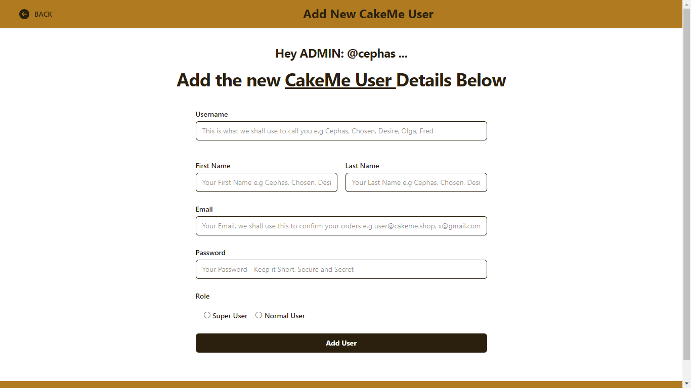

# CakeMe | Love Made Edible (Online Cake Shop)

This is a website for an online cake shop. It is a project built as a team in Recess Term September 2022, Makerere University .

---

## Built In (Django x Python)

This is a website for a cake shop. It is built using Django and Python.

## <u>Members / Contributors</u>

| **Name**                 | **Student No** | **Registration No** |
| ------------------------ | -------------- | ------------------- |
| TWAHIRWA EDWARD          | 2000702075     | 20/U/2075/EVE       |
| NAKIYEMBA ZAITUNI        | 2000707760     | 20/U/7760/PS        |
| NIWAHEREZA SIMON DESIRE  | 2000707803     | 20/U/7803/PS        |
| SSEGINDA FRED            | 2000707813     | 20/U/7813/PS        |
| MUGISA BRIAN             | 2000707823     | 20/U/7823/PS        |
| NIYONGABO OLGA QUEENTHIA | 2000723105     | 20/X/23105/PS       |

## <u>Installation</u>

1. Clone the repository

2. Create a virtual environment

3. Install the requirements

4. Run the server

## <u>Screenshots</u>

This contains the Web Interface of the CakeMe Website with code written in `Python`, `Django`, `TailwindCSS`, `JavaScript`

  <!-- Table of title and image on the right -->

| Screen                        | Image                                                         |
| :---------------------------- | :------------------------------------------------------------ |
| Splash Screen                 |                       |
| Create Account Screen         |             |
| Login Screen                  |                         |
| Shop Screen                   |                           |
| Categories on the Shop Screen |   |
| Search Screen                 |                       |
| Edit Details Screen           |           |
| Cart - CheckOut Screen        |                  |
| Admin - Add Cakes Screen      |         |
| Admin - Add Customer Screen   |  |
| Admin - View All Users Screen |        |

## Resources for Help

- [W3Schools (Create an App)](https://www.w3schools.com/django/django_create_app.php)
- [W3Schools (Add an App to Django)](https://www.w3schools.com/django/django_templates.php)
- [CSS Docs as per Django Girls](https://tutorial.djangogirls.org/en/css/)

## Best way to learn Asap is here

- [Django Tutorial: The Local Library website](https://developer.mozilla.org/en-US/docs/Learn/Server-side/Django/Tutorial_local_library_website)
